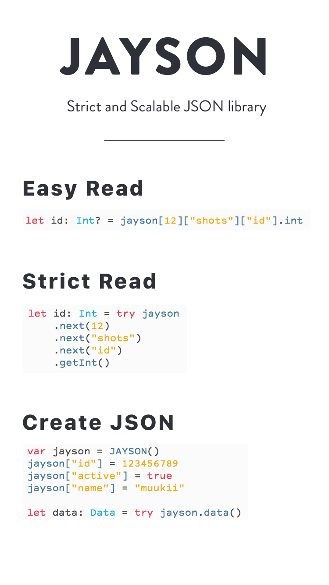

<p align="center">
  
</p>

# JAYSON


[](https://travis-ci.org/muukii/JAYSON)
[](http://cocoapods.org/pods/JAYSON)
[](http://cocoapods.org/pods/JAYSON)
[](http://cocoapods.org/pods/JAYSON)
[](https://github.com/Carthage/Carthage)

Strict and Scalable JSON library.

## Requirements

Swift **3.0**  iOS📱, watchOS⌚️, tvOS📺, macOS🖥, **Linux**✨

# Usage

## Read JSON

### Easy Access (almost same with [SwiftyJSON](https://github.com/SwiftyJSON/SwiftyJSON))

```swift
let urlString: String? = jayson[3]["shot"]["images"]["hidpi_image"].string
```

### Strict Access (try-catch)

if the value does not exist, throw `JSONError`<br>
Failed location can be known from [JSONError](#jaysonerror)

Get Value (String, Bool, Number)

```swift
let id: String = try jayson
       .next(0)
       .next("id")
       .getString()
```

**Get Value with Decoder (Custom Object)**<br>
Using the Decoder can be transformed in a custom object.
And, throwable

```swift
let urlDecoder = Decoder<URL> { (jayson) throws -> URL in
    URL(string: try jayson.getString())!
}


let imageURL: URL = try jayson
       .next(0)
       .next("image")
       .next("hidpi_image")
       .get(with: urlDecoder)
```

**General Getter**

Strict getters

```swift
extension JSON {
    public func getDictionary() throws -> [String : JSON]
    public func getArray() throws -> [JSON]
    public func getNumber() throws -> NSNumber
    public func getInt() throws -> Int
    public func getInt8() throws -> Int8
    public func getInt16() throws -> Int16
    public func getInt32() throws -> Int32
    public func getInt64() throws -> Int64
    public func getUInt() throws -> UInt
    public func getUInt8() throws -> UInt8
    public func getUInt16() throws -> UInt16
    public func getUInt32() throws -> UInt32
    public func getUInt64() throws -> UInt64
    public func getString() throws -> String
    public func getBool() throws -> Bool
    public func getFloat() throws -> Float
    public func getDouble() throws -> Double
}

///
extension JSON {
    public func get<T>(_ s: (JSON) throws -> T) rethrows -> T
    public func get<T>(with decoder: Decoder<T>) throws -> T
}
```

Optional Read-only properties😁
```swift
extension JSON {
    public var dictionary: [String : Any]? { get }
    public var array: [Any]? { get }
    public var string: String? { get }
    public var number: NSNumber? { get }
    public var double: Double? { get }
    public var float: Float? { get }
    public var int: Int? { get }
    public var uInt: UInt? { get }
    public var int8: Int8? { get }
    public var uInt8: UInt8? { get }
    public var int16: Int16? { get }
    public var uInt16: UInt16? { get }
    public var int32: Int32? { get }
    public var uInt32: UInt32? { get }
    public var int64: Int64? { get }
    public var uInt64: UInt64? { get }
    public var bool: Bool? { get }
}
```

#### Initialize JSON

```swift
let jsonData: Data = ...
let jayson = try JSON(data: jsonData)
```

```swift
let jsonData: Data
let json: Any = try JSONSerialization.jsonObject(with: data, options: [])
let jayson = try JSON(any: json)
```

```swift
let userInfo: [AnyHashable: Any]
let jayson = try JSON(any: json)
```

```swift
let objects: [Any]
let jayson = try JSON(any: json)
```

In the case of the following try it is not required.

```swift
let object: [String : JSON]
let jayson = JSON(object)
```

```swift
let object: [JSON]
let jayson = JSON(object)
```

```swift
let object: [JSONWritableType]
let jayson = JSON(object)
```

```swift
let object: [String : JSONWritableType]
let jayson = JSON(object)
```
---

## Get current path (Debugging information.)

```swift

let path = try jayson
    .next(0)
    .next("image")
    .next("hidpi_image")
    .currentPath()

// path => "[0]["image"]["hidpi_image"]"
```

## JSONError

If you have access that does not exist key, throw　`JSONError`.

```swift
public enum JSONError: Error {
  case notFoundKey(key: String, json: JSON)
  case notFoundIndex(index: Int, json: JSON)
  case failedToGetString(source: Any, json: JSON)
  case failedToGetBool(source: Any, json: JSON)
  case failedToGetNumber(source: Any, json: JSON)
  case failedToGetArray(source: Any, json: JSON)
  case failedToGetDictionary(source: Any, json: JSON)
  case decodeError(source: Any, json: JSON, decodeError: Error)
  case invalidJSONObject
}
```

example:

```swift
do {
  let urlString: String = try jayson
    .next("shots")
    .next(0)
    .next("user")
    .next("profile_image")
    .next("foo") // ‼️ throw
    .getString()
} catch {
   print(error)
}
```

Output JAYSONError

```
notFoundKey("foo",
JAYSON
Path: Root->["shots"][0]["user"]["profile_image"]
SourceType: dictionary

Source:
{
    large = "https://...";
    medium = "https://...";
    small = "https://...";
})
```

## Go Back JSON hierarchy

```swift

try jayson
    .next(0)
    .next("image")
    .back() // <---
    .next("image")
    .next("hidpi_image")

```

## Import Example (dribbble API)

```swift
let jayson = try! JSON(data)

struct Shot {
    let id: Int
    let title: String
    let width: Int
    let height: Int
    let hidpiImageURLString: String?
    let normalImageURLString: String
    let teaserImageURLString: String
}

do {
    let shots: [Shot] = try jayson.getArray().map { jayson -> Shot in

        let imagesJayson = try jayson.next("images")

        return Shot(
            id: try jayson.next("id").getInt(),
            title: try jayson.next("title").getString(),
            width: try jayson.next("width").getInt(),
            height: try jayson.next("height").getInt(),
            hidpiImageURLString: try? imagesJayson.next("hidpi").getString(),
            normalImageURLString: try imagesJayson.next("normal").getString(),
            teaserImageURLString: try imagesJayson.next("teaser").getString()
        )
    }
    print(shots)
} catch {
    print(error)
}
```

### Write JSON

```swift
var jayson = JSON()
jayson["id"] = 18737649
jayson["active"] = true
jayson["name"] = "muukii"

var images = [String:JSON]()
images["large"] = "http://...foo"
images["medium"] = "http://...bar"
images["small"] = "http://...fuzz"

jayson["images"] = JSON(images)

let data = try jayson.data(options: .prettyPrinted)
```

-> data
```
{
  "name" : "muukii",
  "active" : true,
  "id" : 18737649,
  "images" : {
    "large" : "http:\/\/...foo",
    "small" : "http:\/\/...fuzz",
    "medium" : "http:\/\/...bar"
  }
}
```

#### JAYSON Convertible Examples

```swift
var jayson = JSON()

jayson["String"] = "String"
jayson["NSString"] = JSON("NSString" as NSString)
jayson["NSNumber"] = NSNumber(value: 0)
jayson["Int"] = 64
jayson["Int8"] = JSON(8 as Int8)
jayson["Int16"] = JSON(16 as Int16)
jayson["Int32"] = JSON(32 as Int32)
jayson["Int64"] = JSON(64 as Int64)

jayson["UInt"] = JSON(64 as UInt)
jayson["UInt8"] = JSON(8 as UInt8)
jayson["UInt16"] = JSON(16 as UInt16)
jayson["UInt32"] = JSON(32 as UInt32)
jayson["UInt64"] = JSON(64 as UInt64)

jayson["Bool_true"] = true
jayson["Bool_false"] = false

jayson["Float"] = JSON(1.0 / 3.0 as Float)
jayson["Double"] = JSON(1.0 / 3.0 as Double)
jayson["CGFloat"] = JSON(1.0 / 3.0 as CGFloat)
```

## Installation

JAYSON is available through [CocoaPods](http://cocoapods.org). To install
it, simply add the following line to your Podfile:

```ruby
pod "JAYSON"
```

## Author

muukii, m@muukii.me

## License

JAYSON is available under the MIT license. See the LICENSE file for more info.
