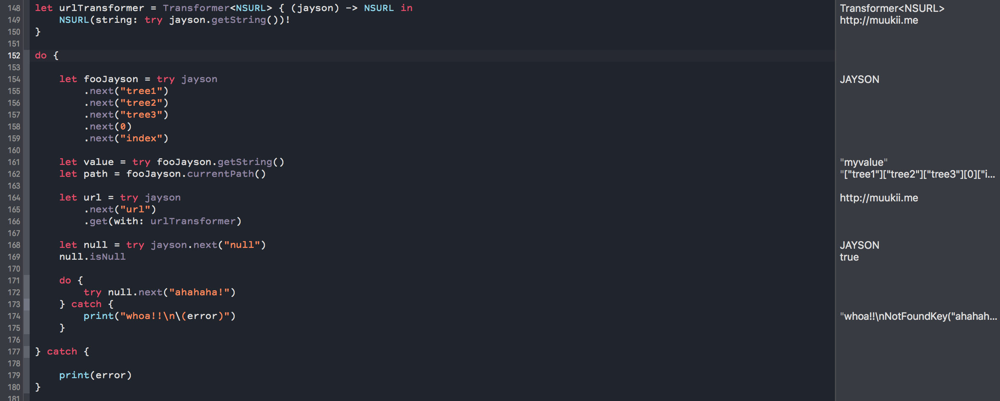

# JAYSON

[](https://travis-ci.org/muukii/JAYSON)
[](http://cocoapods.org/pods/JAYSON)
[](http://cocoapods.org/pods/JAYSON)
[](http://cocoapods.org/pods/JAYSON)

More strict and scalable JSON library.



## Sample

```swift
let jsonData: Data = ...
```

```swift
let id: String = try jayson
       .next(0)
       .next("id")
       .getString()
```

** Scalable Transform**

```swift
let urlDecoder = Decoder<URL> { (jayson) -> URL in
    URL(string: try jayson.getString())!
}


let imageURL: URL = try jayson
       .next(0)
       .next("image")
       .next("hidpi_image")
       .get(with: urlDecoder)
```

** Get current path** (Debugging information.)

```swift

let path = try jayson
    .next(0)
    .next("image")        
    .next("hidpi_image")
    .currentPath()    

// path => "[0]["image"]["hidpi_image"]"
```

** Back JSON hierarchy**

```swift

try jayson
    .next(0)
    .next("image")
    .back() // <---
    .next("image")
    .next("hidpi_image")

```

## Requirements

Swift **3.0**

## Installation

JAYSON is available through [CocoaPods](http://cocoapods.org). To install
it, simply add the following line to your Podfile:

```ruby
pod "JAYSON"
```

## Author

muukii, m@muukii.me

## License

JAYSON is available under the MIT license. See the LICENSE file for more info.
